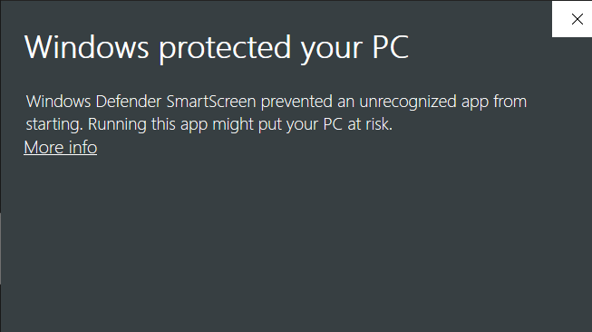

# resumeBuilder
An application based on [C language](https://en.wikipedia.org/wiki/C_(programming_language)) to build Resume

## How to Run
STEP 1- [Download](https://github.com/edoc99/resumeBuilder/archive/master.zip) and unzip the repository. 
STEP 2- Run <strong>ResumeBuilder.exe</strong>  
    
   
  If this window shows up, click on <strong>more info</strong> and then <strong>Run Anyway</strong>.
  
